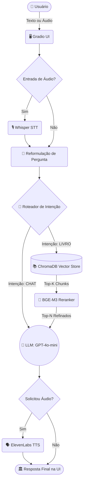

<div align="center">
  
# 🏛️ Oráculo de Marco Aurélio

*A fusão definitiva entre a vanguarda da Inteligência Artificial e a resiliência atemporal da sabedoria estoica.*

[](https://github.com/luizgdev/RAG-Pipeline)
[](https://python.org)
[](https://docker.com)
[](https://langchain.com)
[](https://openai.com)
[](https://gradio.app/)
[](https://debian.org)

</div>

---

## 🚀 O que há de novo na v1.1.0 (Changelog)

- **UX Aprimorada**: Adição de popups nativos de alerta (Gradio Warnings) para entradas vazias, preservando o estado e o histórico do usuário.
- **Concorrência de Áudio**: Refatoração do motor de TTS com arquivos temporários (`tempfile`), permitindo que múltiplos usuários gerem áudio simultaneamente sem sobrescrever arquivos ou causar falhas.
- **Eficiência do RAG**: Prevenção de duplicação de dados no ChromaDB durante re-ingestões e refinamento na captura de metadados das lições (agora capturando letras como "1a", "1b").
- **Roteamento Otimizado**: O classificador de intenção agora ignora saudações de boas-vindas do próprio assistente, poupando tokens e chamadas desnecessárias à LLM.
- **Limpeza MLOps**: A imagem Docker foi otimizada com a remoção de dependências obsoletas como o FFmpeg local, já que toda a síntese de voz (TTS) ocorre externamente via API da ElevenLabs.

---

## 🌟 Destaques Tecnológicos (Key Features)

O pipeline foi desenhado não apenas para responder perguntas, mas para performar como uma arquitetura madura de IA:

- **🚦 Roteamento Semântico**: Avaliação inteligente de intenção para economizar processamento e *tokens*. Saudações fluem limpas; dúvidas profundas ativam a busca.
- **🔍 Reranking Multilíngue (BGE-M3)**: Precisão cirúrgica na recuperação de contexto. O modelo cruza sua query com o acervo vetorizado e refina os top resultados localmente antes de enviar à LLM.
- **🗣️ Interface de Voz**: A voz do Imperador, alimentada pela síntese de alta fidelidade da **ElevenLabs**, traz vida à leitura das *Meditações*. *(Preparado também para transcrição via Whisper)*.
- **⚙️ Arquitetura MLOps**: Separação restrita de responsabilidades. O código segue padrões modernos de modularização (pasta `src/`), preparado para escalabilidade e manutenção assíncrona.

---

## 🧠 O Fluxo da Inteligência

Acompanhe o caminho que a sua pergunta percorre desde a interface até o motor cognitivo:



---

## 🚀 Instalação e Execução (A Via do Docker)

Buscando a excelência no controle de ambientes, o projeto foi arquitetado primariamente para rodar sobre **Contêineres Docker**. A nova arquitetura híbrida de perfis (*profiles*) atende tanto máquinas comuns quanto setups entusiastas.

> [!IMPORTANT]
> **Aviso de APIs:** O Oráculo requer comunicação com serviços externos. Antes de inicializar, garanta que você tenha acesso às chaves da **OpenAI**, **ElevenLabs** e **HuggingFace**.

### 1. Clonando o Repositório
```bash
git clone https://github.com/luizgdev/RAG-Pipeline.git
cd RAG-Pipeline
```

### 2. Configurando o Ambiente
Copie o template de variáveis de ambiente e injete as suas chaves no novo arquivo criado:
```bash
cp .env.example .env
```

### 3. A Ascensão do Contêiner
A imagem Docker foi otimizada na v1.1.0. Escolha um dos dois caminhos de execução abaixo dependendo do hardware disponível:

#### Opção A: Execução Padrão (Recomendado para Avaliadores - Somente CPU)
Executa a aplicação utilizando apenas os recursos da CPU. Ideal para testes universais.
```bash
docker compose up -d
```

#### Opção B: Execução com Aceleração de Hardware (NVIDIA GPU)
Delega o processamento matricial (especialmente do Reranker `BGE-M3`) diretamente para a placa de vídeo, garantindo desempenho excepcional.
```bash
docker compose --profile gpu up -d
```

Acompanhe os logs de inicialização:
```bash
docker compose logs -f
```

> [!TIP]
> 🌐 A interface do Oráculo estará aguardando a sua consulta em: **[http://localhost:7860](http://localhost:7860)**

---

## ⚡ Configuração de Hardware (Otimização GPU)

> [!IMPORTANT]
> **Docker Desktop & NVIDIA:** O `docker-compose.yml` está configurado para executar **Pass-through de GPU NVIDIA**. Se o seu host for Windows, certifique-se de que o WSL2 e os drivers da NVIDIA estejam devidamente instalados e mapeados para o Docker Desktop.

---

## 📂 Estrutura de Pastas

A arquitetura reflete os princípios de um pipeline avançado:

```text
/
├── app.py                     # Entrypoint (Frontend Gradio)
├── Dockerfile                 # Configuração de Imagem (Debian-based otimizada)
├── docker-compose.yml         # Orquestrador MLOps (Profiles híbridos)
├── data/
│   └── processed/chroma_db/   # Vetores Persistidos (ChromaDB)
├── src/
│   ├── data_ingestion/        # ETL: Leitura de PDF e Chunking Semântico
│   ├── retrieval/             # RAG Core: Embeddings, Store e Compressão (Reranking)
│   ├── generation/            # LangChain Core: LLM, Routing e TTS (ElevenLabs)
│   └── evaluation/            # Scripts de avaliação de qualidade de respostas
├── utils/
│   └── prompts.py             # System Prompts, Roteiros e Strings UI Centralizados
└── tests/                     # Suíte de Validação
```

---

## 🛠️ Guia de Contribuição e Testes

A qualidade é inegociável. Para garantir a confiabilidade da geração e a estabilidade das funções, utilizamos o `pytest`. 

Se você estiver desenvolvendo ou contribuindo localmente:
1. Instale as dependências com `pip install -r requirements.txt`.
2. Rode a suíte de validação:

```bash
pytest tests/ -v
```

*“A felicidade da tua vida depende da qualidade dos teus pensamentos.” — Marco Aurélio*
